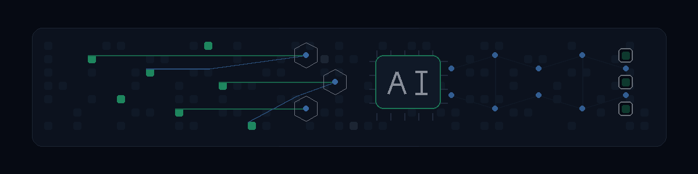

  

# 👋 Jeremy Smith

**Enterprise AI strategy, platforms and multi-agent research**

Building intelligent, private systems

---

### 💼 What I Do

Building **enterprise AI platforms** and researching multi-agent systems. Most of the work comes back to the same question: what can run privately, and what do you end up renting from somebody else.

**Focus Areas:** Enterprise AI Platforms · LLMs & GenAI · MLOps · AI Governance · Multi-Agent Systems

---

### 🎬 ClipForge

<table>
<tr>
<td width="45%" valign="middle">

</td>
<td width="55%" valign="middle">

**The open-source Opus Clip alternative that runs on your desktop.**

Podcasts, webinars and streams in, ready-to-post vertical clips out. AI-picked moments, virality scores, animated captions, auto zoom and speaker-aware reframing. Your footage stays on your machine; you bring an OpenAI key and pay cents per video, not a subscription.

**[Download for macOS, Windows or Linux](https://github.com/JeremySNR/clip-forge/releases/latest)** · [Source and docs](https://github.com/JeremySNR/clip-forge)

</td>
</tr>
</table>

---

### 🚀 More Projects

<table>
<tr>
<td width="50%">

#### 📦 [snug](https://github.com/JeremySNR/snug)
Zero-dependency TypeScript primitive for fitting prioritised content into a token budget. Atomic tool pairs, required items, and a validated result you can hand straight to a model.

</td>
<td width="50%">

#### 🧠 Pluribus: Multi-Agent Research

**[Phase 1](https://github.com/JeremySNR/Pluribus)** · A text-level blackboard hive with cross-inhibition and a structurally protected dissenter (Carol). Agents debate, challenge each other and converge, with one voice that cannot be silenced.

**Phase 2** · Agents communicate through a shared continuous-valued latent buffer rather than text, using BAPC codecs, TIES-Resolve conflict resolution and damped fixed-point iteration. Emergent collective representations confirmed at GPT-2 and 7B scale. Private for now.

</td>
</tr>
<tr>
<td width="50%">

#### 🤖 [snug-openai](https://github.com/JeremySNR/snug-openai) · [snug-anthropic](https://github.com/JeremySNR/snug-anthropic) · [snug-tiktoken](https://github.com/JeremySNR/snug-tiktoken)
Adapters for the snug token budget library. Drop-in fits for OpenAI, Anthropic and tiktoken.

</td>
<td width="50%">

#### 🔀 [converge](https://github.com/JeremySNR/converge)
Zero-dependency TypeScript primitive for converting LLM message arrays between provider formats. OpenAI, Anthropic and Gemini, in either direction. Pure data transformation, no API calls.

</td>
</tr>
<tr>
<td width="50%">

#### 🎨 [ashla-lightroom](https://github.com/JeremySNR/ashla-lightroom)
AI colour grading for Adobe Lightroom Classic. Describe a look in plain language, hand it a reference photo, or let it choose for you. Ashla reads your image and applies the result as a develop preset.

</td>
<td width="50%">

#### 🏛️ [Project Foundry](https://github.com/JeremySNR/Project-foundry)
The governance layer for AI coding agents. Raw tickets in, reviewed pull requests out. Every step is policy-gated, human-approved and audited, with the agent as the muscle and Foundry as the brain and the seatbelt.

</td>
</tr>
</table>

---

### ✍️ Writing

I write at **[jeremysnr.github.io](https://jeremysnr.github.io)** about AI infrastructure, sovereign compute and the industrial decisions Britain is making, or failing to make.

Latest: [Now we have the full details, here's what happened, and here's why it terrifies me](https://jeremysnr.github.io/2026/09/now-we-have-the-full-details/)

---

### 🛠️ Tech Stack

  
  
  
  
   
  
  
  
  

---

### 📊 GitHub Stats

---

*Building AI systems that are intelligent, private, and actually useful.*

